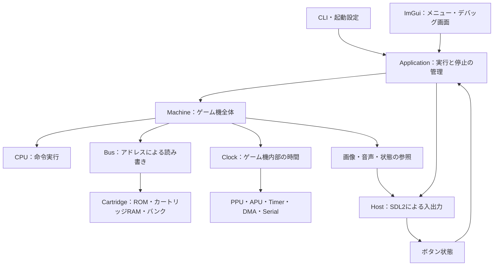

# AdaGBの構成と実装方針

2026-10-09時点の設計案。現在実装済みなのはウィンドウ表示のみであり、
以下のパッケージ名・API・開発段階は今後の実装方針を示す。
ユーザー要件は[spec_input.md](spec_input.md)、既存GUIの実装記録は
[windowing.md](windowing.md)を参照する。

## 設計の目的

Adaの学習題材として構造を理解しやすくしながら、Game Boy Colorのゲームを
軽い処理負荷でプレイできる実装を目指す。

最初の到達点は通常のGame Boy（DMG）の対応範囲を限定したゲーム実行とする。
CPU・メモリ・タイマー・割り込み・画像出力という共通部分を検証してから、
Game Boy Color（CGB）の機能を追加する。DMGを完全再現してからCGBへ進むという
意味ではない。CGBの機種選択、メモリバンク、速度切替を扱える境界は最初から用意する。

## 全体構成



図は役割とデータの流れを示し、Adaのwith依存をそのまま表すものではない。

### エミュレーション本体（Core）

Game Boyの内部動作をAdaで実装する。SDL、ImGui、macOS、ファイルパス、
実時間の待機を参照しない。ROMのバイト列と入力を渡すと、画像・音声・実行状態を
取得できるようにする。同じ入力と内部時間の進行から同じ結果を得られる構成とする。

### 入出力（Host）

Coreが作った画像をSDLテクスチャへ転送し、音声サンプルをSDLの音声キューへ送り、
キーボード等をGame Boyのボタン状態へ変換する。ゲーム機の描画処理はCoreのPPUが
担当し、SDLは完成した画素を表示する。

### 操作画面とアプリケーション（UI / Application）

ImGuiでROM選択、実行・一時停止・リセット、CPUレジスタと逆アセンブルを表示する。
ApplicationがROMのファイル読み込み、設定、保存、実時間との速度調整を担当する。
Coreの内部配列をUIが直接書き換えず、Machineの操作・観測APIを通す。

現在のC++接続コードはSDL / ImGui連携に限定する。CPUやPPUなどゲーム機の動作はAdaで書く。

## Coreのパッケージと責務

| パッケージ案 | 役割 |
| --- | --- |
| `GB.Types` | 8/16ビット値、アドレス、内部時刻、画素・音声の型 |
| `GB.State` | 各装置の状態レコード。処理や外部入出力を持たない内部用の型定義 |
| `GB.Machine` | ゲーム機全体の所有、リセット、実行、入力、出力・デバッグ状態の取得 |
| `GB.CPU` | 命令デコード、レジスタ、フラグ、割り込み受理、HALT / STOP |
| `GB.Bus` | アドレスの振り分け、I/Oレジスタの読み書き、アクセス制限 |
| `GB.Cartridge` | ヘッダー解析、ROM/RAMバンク、MBC、RTC状態 |
| `GB.Clock` | CPUと周辺装置の内部時間を進める |
| `GB.Timer` | DIV / TIMA / TMA / TACの動作 |
| `GB.Interrupts` | IE / IFと割り込み要求の共通処理 |
| `GB.PPU` | LCD状態、背景・ウィンドウ・スプライト、フレーム出力 |
| `GB.APU` | 音源回路、ミキシング、音声サンプル生成 |
| `GB.DMA` | OAM DMA、後にCGBのVRAM DMA |
| `GB.Joypad` | ボタン状態、入力レジスタ、入力による割り込み要求 |
| `GB.Serial` | シリアル転送の時刻と状態。初期は対向機なし |
| `GB.Debug` | 副作用のないメモリ参照、逆アセンブル、実行観測 |

全パッケージの雛形を一度に作らず、担当機能の実装時に追加する。

各Machineインスタンスが状態を所有する。変更可能なパッケージ全域変数を避け、
内部の処理は状態を`in out`で受け取る。`GB.State`を共通の下位パッケージに置き、
CPUとBusがお互いの状態型をwithする循環を避ける。

CPUのメモリ操作には時間を進める内部ヘルパーを使い、Busのアドレス振り分け自体は
時間を進めない。DMA用の読み書きとデバッガーの参照をCPUの読み書きと区別する。
周辺装置がCPU処理を呼び返す構成にしない。DMAの転送要求や割り込み要求は状態へ
記録し、実行制御側で処理することで、BusとDMAの相互依存を避ける。

## 公開APIの方針

Machineから公開する操作は、おおむね次のものとする。シグネチャは実装時に確定する。

- `Load_Cartridge`：検証済みROMバイト列を渡す。未対応MBCは明示的に失敗させる。
- `Reset`：機種と動作モードに対応した起動後状態へ戻す。
- `Set_Buttons`：ホスト入力を反映する。
- `Step_Instruction`：1命令または割り込み受理等の境界まで進める。
- `Run_For`：指定した内部時間の範囲で実行する。実際に進んだ時間を返す。
- `Frame_Ready` / `Get_Frame`：完成フレームを取得する。
- `Drain_Audio`：生成した音声サンプルを取得する。
- `Get_Debug_Snapshot` / `Peek`：レジスタやメモリを副作用なく参照する。

`Run_For`には命令境界による小さな超過を許容し、アプリ側は実際の内部時刻で
次の実行量を調整する。LCD停止時やHALT中にも帰ってくる有限時間のAPIとし、
「次の画面ができるまで無制限に待つ」実行APIを基本にしない。

ROMファイルの読み込みと診断はApplication側で行う。Coreはファイルの開き方を知らない。
デバッグ参照はI/Oの状態を変えず、命令実行や内部時間も進めない。

## 時間管理

命令の結果だけでなく、いつ読み書きや割り込みが発生するかも再現する。
画面は段階的に描画され、描画中のメモリアクセスにも制限がある。
[Pan Docs: Rendering](https://github.com/gbdev/pandocs/blob/master/src/Rendering.md)

CPU命令を解釈するインタープリター方式とする。初期からCPUの読み書きと内部待機を
M-cycle単位で組み立て、Clockに渡す。最初のCPU単体検証では周辺装置の精密な実装を
省略できるが、命令完了後に時間を一括で足す方式を最終設計にはしない。
割り込み受理、条件分岐の所要時間、EIの遅延、HALTの挙動も個別に扱う。

CPUのT-cycle数とPPUのdot数を別の型・名前で管理する。CGBの倍速モードでは
CPUとPPUの時間比が変わるため、Clockが変換し、Timer・Serial等は装置ごとの
クロック規則に従う。[Pan Docs: Rendering](https://github.com/gbdev/pandocs/blob/master/src/Rendering.md)

TimerはDIV内部カウンターの状態と選択したビットの変化を基に実装する。
DIV / TACへの書き込みやオーバーフロー時の遅延は専用テストで確認する。
[Pan Docs: Timer](https://github.com/gbdev/pandocs/blob/master/src/Timer_Obscure_Behaviour.md)

実機の時間とホストの時間を分ける。ホストのVSyncやSDL待機をCPUのクロックにしない。
アプリは単調増加する実時間を用いて有限量のCore実行とイベント処理を繰り返す。
負荷で遅れた場合には表示更新を間引けるようにするが、ゲーム機内部の処理を飛ばさない。
長い停止後は追い付き量を制限してUIの応答を保つ。

## メモリとAdaの型

BusはROM、VRAM、カートリッジRAM、WRAM、OAM、I/O、HRAMをアドレスで
振り分ける。単一の64KiB配列をゲーム機全体として扱わない。ROM領域への書き込みが
バンク切替になる場合や、I/Oの読み書きに副作用があるためである。
[Pan Docs: Memory Map](https://github.com/gbdev/pandocs/blob/master/src/Memory_Map.md)

8/16ビット値はAdaのモジュラー型または`Interfaces.Unsigned_8/16`を使い、
実機の桁あふれを明示する。CPUのフラグ計算では広い中間型を使う。
固定サイズのRAMと画面は配列、装置状態はレコードで表現する。
ROMのサイズやヘッダーは読み込み時に検証し、任意サイズの破損ファイルで配列範囲外に
アクセスしない。命令実行中のヒープ割り当ては避ける。

MBCは初期段階では種別と`case`分岐で実装する。最初はROM-only、次にMBC1、
MBC3（RTCを含む）、MBC5、MBC2を追加する。未対応のカートリッジを別のMBCとして
実行しない。対応タイトルの範囲はテスト結果に基づいて記載する。

## 起動状態とCGBの扱い

仕様どおり実BIOS ROMの読み込みには対応しない。ブートROMがゲームへ制御を渡した
後の状態を設定し、`PC = 0x0100`から開始する。レジスタだけでなくI/Oや描画関連の
状態も機種・モードに合わせる。CGBの初期状態にはROMヘッダーに依存する項目があるため、
DMG用の定数を全機種へ流用しない。
[Pan Docs: Power-Up Sequence](https://github.com/gbdev/pandocs/blob/master/src/Power_Up_Sequence.md)

機種（DMG / CGB）とゲームの動作モード（DMG互換 / CGB）を区別する。
初期の自動選択は通常GB ROMをDMG、CGB対応ROMをCGBで動かす方針とし、
両対応ROMもCGBを優先する。将来の機種指定にも対応できるようにする。

CGBで追加する主要な機能はカラーパレット、VRAM / WRAMバンク、タイル属性、
倍速モード、VRAM DMAとする。機種差は各装置内へ閉じ込め、UIに判定を散在させない。
[Pan Docs: CGB Registers](https://github.com/gbdev/pandocs/blob/master/src/CGB_Registers.md)

## 画面・音声・入力とデバッグUI

PPUの最初の描画実装は走査線単位で背景から始め、ウィンドウとスプライトを加える。
PPUのモード、割り込み、CPUアクセス制限は描画の簡略化とは分けて管理する。
走査線途中の変更や正確な描画時間が必要なタイトル・テストへの対応では、
内部描画をpixel FIFO方式へ改善する。走査線方式の段階では再現精度の制限を記録する。

Hostは160×144の画像を整数倍率・最近傍補間で表示する。CPUレジスタ、逆アセンブル、
一時停止・1命令実行を先に整え、メモリビューやブレークポイントは後から追加する。
命令長等の共通メタデータを使い、実行器と逆アセンブルの命令解釈が食い違うのを避ける。

APUは最初の画面出力と操作が成立した後に追加する。音声デバイスを開けなくても
無音で実行可能にする。Coreは要求されたサンプルレートでサンプルを生成し、
ホスト側は有限サイズのSDL音声キューを管理する。音声の再生速度に合わせる調整は
ホスト側で行い、内部クロックの比率を変えて音程を合わせない。

最初は単一スレッドで実装する。UI、Core、保存処理が同じスレッドで状態を扱い、
デバッグを容易にする。性能測定で必要性が確認できた場合にスレッド分離を検討する。

## 設定・セーブ

保存先は仕様の`~/Library/Application Support/AdaGB/`とし、実際のホームディレクトリは
実行時に取得する。設定がなければデフォルトを作る。設定・バッテリーセーブ・
ステートは同じ基底ディレクトリの下で種類ごとに整理する。

カートリッジRAMの保存とステート保存を分ける。セーブはゲームの永続データであり、
ステートはCPU・装置・メモリ・内部時刻を含む実行状態である。
ROM内容のハッシュで保存ファイルを識別し、同名ROMの衝突を避ける。
RAM更新時にdirtyを記録し、定期保存・ROM切替・正常終了時に安全に書き出す。

保存は一時ファイルを経由して置き換える。ステートには形式バージョン、機種・モード、
ROM識別情報を付ける。Adaレコードのメモリ表現をそのままファイルにせず、
バイト順とフィールドを定義した形式で保存する。RTCのホスト時刻との対応は保存層で
管理し、テストでは時計を固定できるようにする。

## ソースとビルドの整理案

```text
src/
  adagb.adb              起動処理
  core/                 GB.*：ゲーム機内部
  app/                  CLI・設定・ROMファイル・保存・実行管理
  host/                 SDL接続、画像転送、音声、入力
  ui/                   ImGuiの画面
  debug/                状態観測・逆アセンブル
  headless/             画面なしの検証用メイン
  support/              UIとCoreで共有しない汎用処理
tests/
  unit/                 型・命令・装置の個別テスト
  roms/                 テストROMの実行定義と取得元情報
scripts/
  build.sh              利用者・開発・CI共通のビルド入口
  test.sh               Coreの自動検証
docs/dev/
  architecture.md       本設計
  spec_input.md         ユーザー要件
  windowing.md          GUI実装・検証記録
```

図の`tests/`と`docs/`はリポジトリ直下のディレクトリ。
Core用GPRを独立させ、GUI用GPRとテスト用GPRが参照する。
Coreのテストとheadless実行はSDL / ImGuiをリンクしない。
現在の`src/`配置を段階的に移し、GPRのSource_Dirsも同時に変更する。
学習のための整理に留め、未実装機能用の過剰な抽象化は導入しない。

## 検証方針

CPU単体では結果、フラグ、PC / SP、メモリ、所要時間を確認する。特に桁あふれ、
half-carry、DAA、条件分岐、スタック、CB命令、割り込みとHALTの境界を検証する。
周辺装置では内部時刻とI/O書き込みの組み合わせをテストする。

統合検証には実機で確認されているテストROMを利用する。
[Mooneye Test Suite](https://github.com/Gekkio/mooneye-test-suite)には機種・リビジョンごとに
期待結果が異なるテストがあるため、対象機種を明示して実行する。
初期はCPU・Timer等の対応済み項目を選び、未対応項目は理由を付けて記録する。
ブートROM実行過程を検証するテストは、このプロジェクトの起動方式とは区別する。

headless実行は内部時間の上限、合否判定、終了コードを持つ。Mooneye用の
完了プロトコルはテストランナーが観測し、通常の命令動作を変更しない。
PPUの結果は画素比較、音声は生成サンプルの比較で検証し、GUIは短い起動確認と
手動操作確認を別に扱う。テストROMの版・ライセンス・期待結果を記録する。

CIはCoreテストとGUIビルドを分ける。既存要件の変更ファイルに応じたトリガーと
共通スクリプトを使う。頒布はアーキテクチャ別zipを維持する。
macOS 13.5の最低対応には、対応するGNATランタイムとSDL2の用意・実機確認が別途必要。

## 実装の順序と完了条件

| 段階 | 実装内容 | 完了条件 |
| --- | --- | --- |
| 1 | Coreの分離、ROM読込・ヘッダー表示、ROM-onlyのBus、起動状態 | CLIからROM情報を確認でき、不正・未対応ROMを診断できる |
| 2 | CPU全命令と基本割り込み、有限時間実行、headlessランナー | CPU単体テストと選定したCPUテストROMが通る |
| 3 | Timer、Serial、OAM DMA、PPUの時刻・アクセス制限 | 対応する装置テストが通り、VBlank等を正しく発生できる |
| 4 | DMG背景・ウィンドウ・スプライト、入力、MBC1 | 対応範囲を明示したDMGゲームを画面と入力で操作できる |
| 5 | カートリッジRAM保存、APU、MBC3 / RTC・MBC5・MBC2 | セーブ再開と音声が確認でき、対応タイトルを増やせる |
| 6 | CGBモード、パレット・バンク・属性・倍速・VRAM DMA | 選定したCGBテストとゲームが動く |
| 7 | PPU精度改善、デバッガー拡充、ステート、設定・配布整備 | 精度と互換性の制限を記録し、対象環境で検証できる |

段階の中でレジスタ表示と1命令実行は早めに導入する。保存・音声・CGBの実装順は
対応したいゲームとテスト結果に応じて調整できる。

次の実装単位は段階1とする。CPU本体を作る前にROMの読み込みとメモリの意味を
確定させることで、その後の命令テストに使える土台を用意する。
